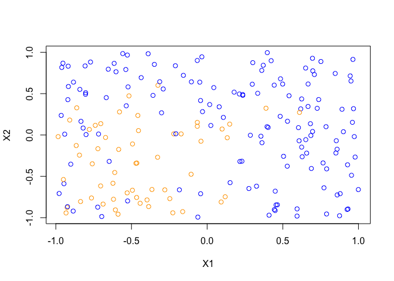

## R Markdown

This is an R Markdown document. Markdown is a simple formatting syntax for authoring HTML, PDF, and MS Word documents. For more details on using R Markdown see <http://rmarkdown.rstudio.com>.

When you click the **Knit** button a document will be generated that includes both content as well as the output of any embedded R code chunks within the document. You can embed an R code chunk like this:


```r
library(ggplot2)
#setting functions for each variable
bias <- function(x) 1/x
variance <- function(x) .005*x^2
variance_e <- function(x) 1
MSE_training <- function(x) -.0005*(x-12)^3 + .75
MSE_test <- function(x) .0003*(x - 8)^4 + 1.1
ggplot(data = data.frame(x = c(0, 20)), aes(x)) + stat_function(fun = bias, aes(color = "bias")) + stat_function(fun = variance, aes(color = "variance")) + stat_function(fun = variance_e, aes(color = "variance_e")) + stat_function(fun = MSE_training, aes(color = "MSE_training")) + stat_function(fun = MSE_test, aes(color = "MSE_test")) + xlim(0, 20) + ylim(0, 2.5) + xlab("flexibility") + ylab("values") + scale_color_manual("Curves", values = c("red", "blue", "green", "orange", "purple"))
```

```
## Warning: Removed 19 rows containing missing values (geom_path).
```

<!-- -->

## Including Plots

You can also embed plots, for example:


```r
#(a) setting a random number generator seed
set.seed(500)
#(b) simulating a dataset of N = 200 with X1 and X2 as random uniform variables [0, 1]
X1 <- runif(200, -1, 1)
X2 <- runif(200, -1, 1)
X1
```

```
##   [1]  0.66719993  0.45002358  0.95062832 -0.06479233  0.62455625
##   [6] -0.58860832  0.02436381  0.85093209  0.65766281  0.42315408
##  [11] -0.43587815  0.78568541  0.52941242 -0.67130594  0.46414880
##  [16] -0.49378764  0.01675899  0.23562757  0.21656866 -0.49316462
##  [21] -0.84370314  0.61863613 -0.92513830  0.07975247 -0.46450197
##  [26]  0.62810028  0.38892964  0.78921612 -0.92038830 -0.73908642
##  [31] -0.86506044 -0.92285035  0.23519352 -0.80356770 -0.24678168
##  [36]  0.68556176  0.65079256 -0.91822459  0.85870620 -0.90797032
##  [41] -0.61065304 -0.15693360  0.66687517 -0.03061364  0.70868944
##  [46]  0.17849127  0.15173782 -0.06503133 -0.52259379 -0.52557434
##  [51] -0.53749827  0.97797580 -0.06489835 -0.86163875 -0.61445757
##  [56]  0.30167662 -0.84109025  0.62453294  0.92797747  0.44327383
##  [61] -0.94616579  0.54126454  0.68868353 -0.22687891  0.85950420
##  [66] -0.93242430 -0.22060770 -0.53431503 -0.65333411 -0.60229676
##  [71] -0.32502329 -0.83366409 -0.88521873 -0.97803941  0.73704029
##  [76] -0.61890083 -0.35769897 -0.94120829 -0.72313279 -0.52723102
##  [81] -0.31339407  0.92509301  0.93084590 -0.51651914 -0.03485849
##  [86]  0.75181235  0.59425776  0.37094422  0.14898650  0.32631005
##  [91]  0.21306997  0.60338641 -0.32742361 -0.04345508 -0.27964068
##  [96]  0.95395901 -0.72176489 -0.91680731 -0.38975068 -0.83665999
## [101]  0.69678050 -0.77840501  0.45535268 -0.77079633  0.97245564
## [106]  0.78982337 -0.47041103 -0.16179263  0.72735881 -0.80275426
## [111]  0.27593513  0.13301195 -0.10396369  0.90044796 -0.95282168
## [116]  0.60779366 -0.06137127  0.68253588 -0.90121074  0.29846874
## [121]  0.89139143  0.94543540 -0.76438318 -0.17188581  0.49909595
## [126] -0.18329424 -0.96070335  0.44414568  0.96722604  0.95996540
## [131] -0.30128316 -0.80639136  0.10721554  0.04384922 -0.75892173
## [136] -0.45780954  0.35540804  0.40306880 -0.45377363  0.36241435
## [141] -0.39721094  0.28555096  0.61031540  0.87506102  0.36097152
## [146]  0.53100585 -0.96428873 -0.60626590 -0.69654608  0.59441929
## [151]  0.87934167  0.50488718 -0.55766844 -0.98444803  0.48488047
## [156]  0.09261622  0.11922019  0.33402537 -0.64714654 -0.46605768
## [161]  0.85350591  0.96335057 -0.04303904  0.39749763  0.69806725
## [166] -0.29010090 -0.62245461 -0.10595228 -0.36465590  0.39585362
## [171] -0.70288922  0.84634734 -0.44270133 -0.04075279 -0.81953479
## [176] -0.34857295  0.44947005 -0.88326466 -0.20982194  0.09891239
## [181] -0.57907197 -0.04875731  0.40923799  0.69603801 -0.38649303
## [186] -0.70384894 -0.68761349  0.22983969  0.77200201  0.99926397
## [191]  0.65177874  0.48267782  0.76606405 -0.71757095 -0.80018418
## [196] -0.66642980 -0.58461518 -0.20671102 -0.94964695 -0.52852599
```

```r
X2
```

```
##   [1]  0.616412713 -0.679367786  0.652510463  0.152524908  0.435887678
##   [6] -0.957581239  0.114864808 -0.217854511 -0.219271348  0.898538291
##  [11]  0.693629236  0.100234717 -0.377291224 -0.030189699 -0.844131506
##  [16] -0.668036504  0.368015361  0.479541233 -0.319931817 -0.108620823
##  [21] -0.243495982  0.315826690 -0.877065888  0.340788937 -0.339286349
##  [26] -0.262931813  0.323601088 -0.955060403  0.427312391  0.116576761
##  [31] -0.127548154 -0.866527988  0.488648110  0.492016360 -0.769738287
##  [36] -0.006436397  0.809399886  0.832054330 -0.171980234  0.180594997
##  [41] -0.453656943  0.721115651  0.344793854  0.282462294  0.730988639
##  [46]  0.517956876 -0.576477638  0.900868820  0.581607231 -0.797611814
##  [51]  0.791635054 -0.267112093  0.105306237  0.328499386  0.865964579
##  [56]  0.874637189  0.551192375 -0.146844101 -0.360292799  0.602594553
##  [61] -0.589260516  0.474736162 -0.405241210 -0.941100671 -0.724956635
##  [66] -0.942473050  0.013723733  0.353234767  0.795351092  0.764503092
##  [71]  0.600974373  0.165045327 -0.920053096 -0.707396716  0.428626539
##  [76] -0.777226551  0.478848980  0.009815986 -0.872384111  0.966514871
##  [81]  0.644193849 -0.900660550 -0.894622633  0.472855154  0.944889942
##  [86]  0.888527705 -0.980634416  0.842939293  0.131342422 -0.619329926
##  [91]  0.495826668  0.088901952 -0.269303969  0.416650026 -0.663323510
##  [96] -0.487316282 -0.166045001  0.586015864  0.982748982 -0.804576085
## [101]  0.042164902  0.066878046 -0.845813832  0.882290100 -0.019441857
## [106] -0.409560829 -0.341734607 -0.926901666  0.322672897  0.511009746
## [111] -0.647275977 -0.033247241  0.642939677  0.039491552  0.868522629
## [116] -0.069811523 -0.992868299  0.136548046 -0.353065215  0.614192778
## [121]  0.311131027  0.714245376 -0.761685545  0.013046460  0.616070561
## [126] -0.663059702  0.816550180 -0.902432403  0.318377500  0.153051438
## [131]  0.268573566  0.835180532  0.212365390  0.573046505 -0.348325625
## [136]  0.236057004 -0.014865692  0.091552218  0.053131919 -0.093219913
## [141] -0.785160958 -0.003067335  0.272832968 -0.976315283  0.780895672
## [146]  0.165924127  0.236834255 -0.905728755 -0.986256293 -0.893508409
## [151] -0.709346177 -0.257801246  0.984431920 -0.019711111  0.679617041
## [156] -0.810088164 -0.746814135  0.504051573 -0.319353756 -0.755668432
## [161] -0.069236173  0.913918160 -0.710393996  0.995538753  0.776125373
## [166]  0.556691437 -0.583713028 -0.474851053 -0.659174588  0.100238490
## [171]  0.137153200  0.743889743 -0.825768470 -0.075326911  0.084102563
## [176]  0.853521652 -0.912925024  0.639043615  0.837498983  0.072042384
## [181]  0.279036014  0.638732842 -0.969854753  0.927348020 -0.865578101
## [186] -0.616021322 -0.835716075 -0.317409669 -0.638519811 -0.660086860
## [191] -0.056339211  0.225209693 -0.337962161  0.011546555  0.004747626
## [196]  0.451860771 -0.174212539  0.015007309 -0.538626688 -0.699773873
```

```r
#(c) calculating equation with epsilon
e <- rnorm(200, 0, sqrt(.25))
y <- X1 + X1^2 + X2 + X2^2 + e
y
```

```
##   [1]  1.572866359  1.296610792  3.148413901 -0.130600255  1.643710995
##   [6] -0.139200582  0.407742711  1.431515550  0.622084568  2.128435430
##  [11]  1.006726825  2.168794294  0.868903675 -1.171269938  0.322044473
##  [16] -0.573620613  0.478677945  1.808265518  0.024475600 -0.468297775
##  [21] -0.247518673  1.319766124 -0.687424158  0.937642110 -0.129045135
##  [26]  1.449702725 -0.073971555  1.189375006  0.106437512 -0.110396596
##  [31] -0.279968190  0.123546116  0.092330790  0.261514410 -0.522226906
##  [36]  0.356107613  2.573988855  0.492214828  1.798708984 -0.097493060
##  [41] -0.498608451  1.461931190  2.265528900  0.111448819  2.361809461
##  [46]  1.891007481  0.520454172  1.676083873  1.238173572  0.071075234
##  [51]  0.482185821  2.612994917 -0.339906671 -0.122070792  1.024450343
##  [56]  1.278435664  0.284168900  0.315445067  1.745345449  1.821552922
##  [61]  0.308585097  1.475680489  1.700884721 -0.459508250  1.891841773
##  [66] -0.816882209 -0.376428470  0.144148581  0.091138677  1.352879546
##  [71] -0.022943220  0.118177391  0.291219202  0.036799176  1.290017412
##  [76] -0.925354574  0.253097351  0.447414673  0.144172828  0.794334708
##  [81]  0.956451081  1.461233665  1.347623454 -0.433063948  1.667168676
##  [86]  3.060527389  1.374444057  2.380094488 -0.340460673  0.386286440
##  [91]  1.463347863  1.231356783 -0.448422598  0.368852400 -0.438819301
##  [96]  1.531232643 -0.261649970  0.837645044  0.654671837 -0.576257383
## [101]  1.765929186 -0.765294307  1.122111961  2.205002940  0.986792688
## [106]  0.867313069 -0.809219714 -0.587364439  1.835087552  0.875589662
## [111]  0.052689029 -0.857547171  1.113432412  1.990183178  1.649721091
## [116]  1.071947618  0.254616974  1.400888121  0.377606651  1.682299784
## [121]  2.723150982  2.648894716 -0.797839690 -0.340668016  2.212891687
## [126]  0.639676644  1.889711117  0.210202686  2.116088993  2.242202635
## [131]  0.282830737  1.728310396  0.204316026  1.364361836 -0.763567181
## [136] -0.498124096  0.248046871  1.003979840 -0.193564945  0.251476213
## [141] -0.035465648  0.750621238 -0.026948146  1.612927648  2.107176178
## [146]  0.783413894  0.222168714 -0.080355806  0.014817974  1.014628726
## [151]  1.312695001  1.048383182  2.106730743 -0.497133929  1.899518340
## [156] -0.315728964 -0.138112736  1.880476203  0.403169228 -0.450588708
## [161]  1.803497312  3.591610855  0.079282884  2.466307171  2.772948938
## [166]  0.455683267 -1.051564190 -0.158331757 -0.943764325  0.938830362
## [171] -0.659441678  2.185565963 -1.117581932 -1.335560326  0.005782709
## [176]  2.620166324  1.343747323  0.677839930  1.996642629 -0.390037678
## [181] -0.045470614  1.727868620  0.229842368  2.558612785 -0.023014228
## [186] -0.173349551 -0.614723267  0.273549829  0.675363212  1.877165188
## [191]  0.937566066  1.366934984  0.471867302  0.317866367  0.051346814
## [196]  0.651767366 -0.649658061  0.527212640 -0.265517914 -0.076074394
```

```r
#(d) calculate the probability of success bounded
y_prob <- exp(y)/(1 + exp(y))
y_prob
```

```
##   [1] 0.8281918 0.7852640 0.9588462 0.4673963 0.8380393 0.4652559 0.6005465
##   [8] 0.8071373 0.6506925 0.8936364 0.7323791 0.8974120 0.7045175 0.2366255
##  [15] 0.5798224 0.3604018 0.6174356 0.8591521 0.5061186 0.3850192 0.4384343
##  [22] 0.7891428 0.3346063 0.7186231 0.4677834 0.8099527 0.4815155 0.7666293
##  [29] 0.5265843 0.4724288 0.4304616 0.5308473 0.5230663 0.5650085 0.3723317
##  [36] 0.5880979 0.9291687 0.6206281 0.8579917 0.4756460 0.3778677 0.8118279
##  [43] 0.9059816 0.5278334 0.9138683 0.8688704 0.6272540 0.8423853 0.7752459
##  [50] 0.5177613 0.6182639 0.9316932 0.4158321 0.4695201 0.7358386 0.7821834
##  [57] 0.5705680 0.5782138 0.8513648 0.8607524 0.5765399 0.8139193 0.8456502
##  [64] 0.3871025 0.8689654 0.3064259 0.4069886 0.5359749 0.5227689 0.7946000
##  [71] 0.4942644 0.5295100 0.5722946 0.5091988 0.7841501 0.2838681 0.5629387
##  [78] 0.6100244 0.5359809 0.6887613 0.7224107 0.8117213 0.7937408 0.3933949
##  [85] 0.8411980 0.9552349 0.7980972 0.9152968 0.4156976 0.5953884 0.8120442
##  [92] 0.7740560 0.3897359 0.5911816 0.3920223 0.8221866 0.4349582 0.6979690
##  [99] 0.6580625 0.3597942 0.8539507 0.3174979 0.7543803 0.9006979 0.7284540
## [106] 0.7041863 0.3080568 0.3572398 0.8623667 0.7059075 0.5131692 0.2978521
## [113] 0.7527685 0.8797625 0.8388534 0.7449671 0.5633126 0.8023248 0.5932957
## [120] 0.8432088 0.9383790 0.9339428 0.3104878 0.4156472 0.9014012 0.6546804
## [127] 0.8687226 0.5523580 0.8924571 0.9039758 0.5702401 0.8491962 0.5509021
## [134] 0.7964677 0.3178723 0.3779816 0.5616957 0.7318403 0.4517593 0.5625398
## [141] 0.4911345 0.6793140 0.4932634 0.8338175 0.8915987 0.6864154 0.5553148
## [148] 0.4799219 0.5037044 0.7339250 0.7879638 0.7404643 0.8915557 0.3782144
## [155] 0.8698370 0.4217170 0.4655266 0.8676658 0.5994489 0.3892208 0.8585741
## [162] 0.9731850 0.5198103 0.9217458 0.9411964 0.6119896 0.2589248 0.4604995
## [169] 0.2801406 0.7188633 0.3408650 0.8989458 0.2464601 0.2082411 0.5014457
## [176] 0.9321482 0.7931055 0.6632564 0.8804441 0.4037082 0.4886343 0.8491396
## [183] 0.5572090 0.9281500 0.4942467 0.4567708 0.3509825 0.5679642 0.6627030
## [190] 0.8672852 0.7186078 0.7968845 0.6158256 0.5788042 0.5128339 0.6574086
## [197] 0.3430666 0.6288328 0.4340078 0.4809906
```

```r
#(e) plot the points
plot(X1, X2, xlab = "X1", ylab = "X2", col = ifelse(y_prob > .5, 'blue', 'orange'))
```

<!-- -->

